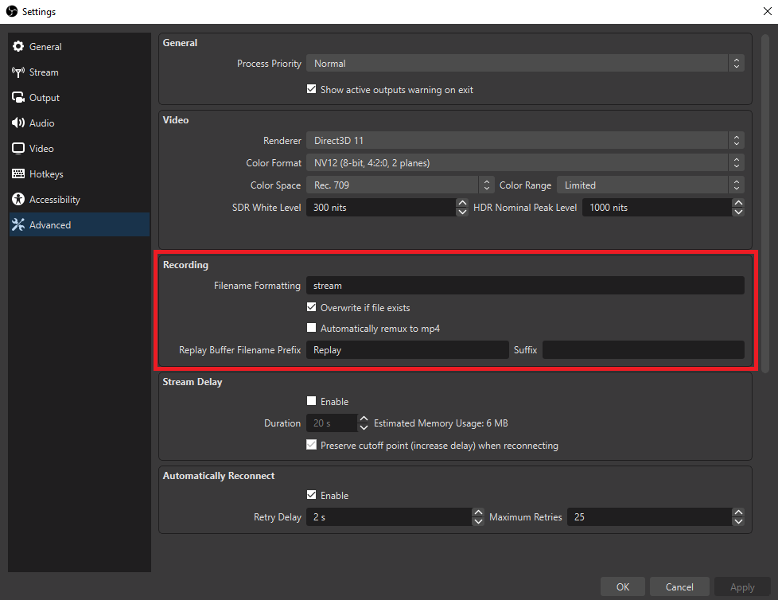
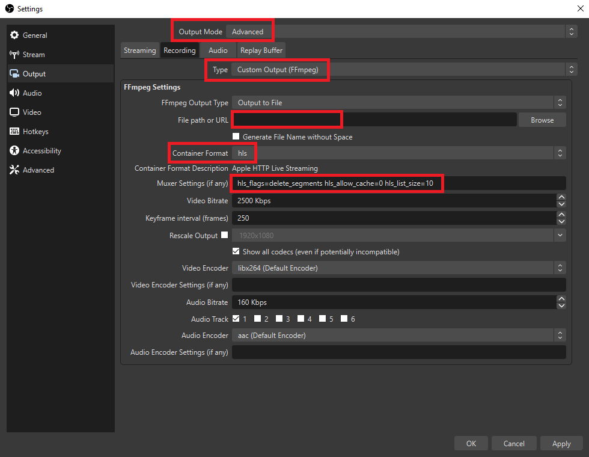

# OBS-to-local-webplayer-HLS
Stream video using OBS to a webpage. Includes SSL certbot integration.

(Having a domain, Docker and Docker-Compose installed is needed.)

---

If you just want a simpler version or you don't pretend to run it under a domain name:

Check the localhost version: [OBS-to-local-webplayer-HLS](https://github.com/Pablotesan/OBS-to-local-webplayer-HLS)

---

Steps:
1. Set up the webpage:

    - Create a domain redirection to the ip hosting the web.

    - Make sure that the the port 80 and 433 are opened and accesible.

    - Set up your domain name in the "nginx-conf/stream.conf" file replacing "<\<your-domain\>>" with your domain. Example: "google.com"

    - Start the web-server:

        - Start the containers using: ```docker-compose up -d```

        - On the first run:

            - Create the ssl certificate:

                - Run this command replacing "<\<your-domain\>>" with your domain:

                    ```docker compose run --rm  certbot certonly --webroot --webroot-path /var/www/certbot/ --dry-run -d <<your-domain>>```
                    
                - If the "dry-run" is successful, you can generate the certificate with the same command (replacing "<\<your-domain\>>" with your domain) but without the dry-run option:
                    ```docker compose run --rm  certbot certonly --webroot --webroot-path /var/www/certbot/ -d <<your-domain>>```

            - Uncomment the second "server" section in the "nginx-conf/stream.conf" file.

            - Restart the containers using: ```docker-compose restart```

        - If you need to renew the cert, run:

            - ```docker compose run --rm certbot renew```

      

2. Configure OBS.

    - In "Settings/Advanced" in "Recording" section:

        - Set Filename Formatting to: "stream".
        - Set "Overwrite if file exists".

          


    - In "Output" section, using Advanced mode:

        - Set "Type" to "Custom Output FFMmpeg"
        - Set "File path" to the "video" folder cloned with the repository.
        - Set "Container Format" as "hsl".
        - Configure "Muxer Settings" as you like. 

          For example:

          ```hls_flags=delete_segments hls_allow_cache=0 hls_list_size=10```

          Will keep up to 10 fragments and remove older ones when new ones are genereated.


          

3. Go to "```https://<<your-domain>>```" and enjoy.
